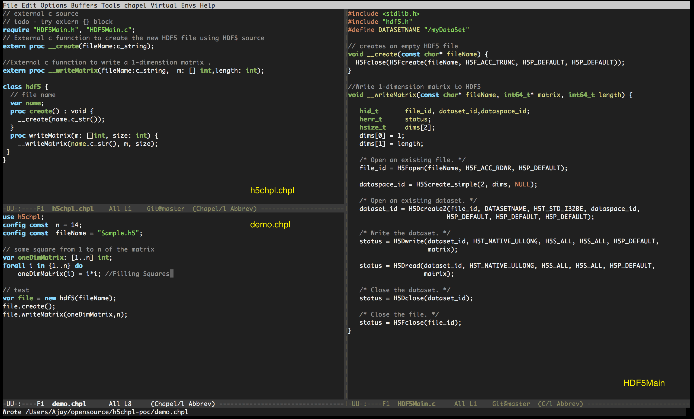
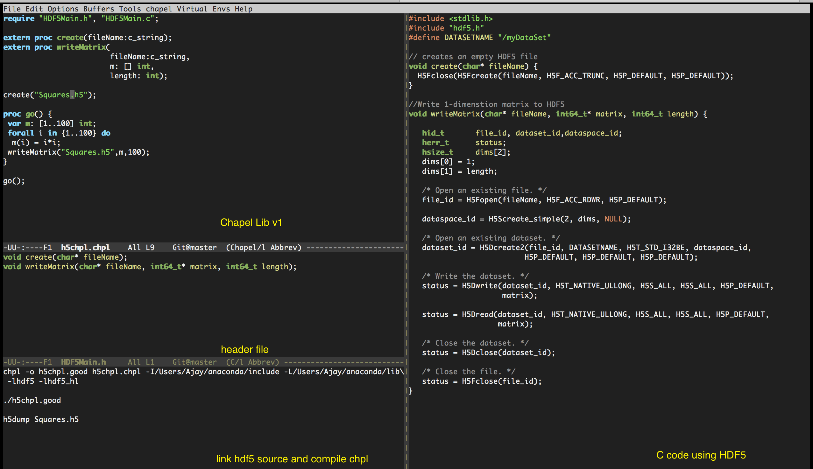

# HDF5 Lib for Chapel - Proof of concept

---
### Compile and link HDF5 source code.
```
chpl -o demo.good demo.chpl  -I/Users/Ajay/anaconda/include -L/Users/Ajay/anaconda/lib -lhdf5 -lhdf5_hl
```

### Execution
```./demo.good --n=10 --fileName=Sample.h5```

### Veryfy HDF5 file
```  h5dump Sample.h5  ```

## Test Results
_run.sh_ contains above comands in one place. I am executing run.sh script.

### *Output*
<pre>
03:14:17 macOS_ ⚡  ./run.sh
HDF5 "Sample.h5" {
GROUP "/" {
   DATASET "myDataSet" {
      DATATYPE  H5T_STD_I32BE
      DATASPACE  SIMPLE { ( 1, 10 ) / ( 1, 10 ) }
      DATA {
      (0,0): 1, 4, 9, 16, 25, 36, 49, 64, 81, 100
      }
   }
}
}
</pre>

---

### 🐙 History

### Summary of  codebase version-2. 🚀




---
### Summary of new codebase version-1.


